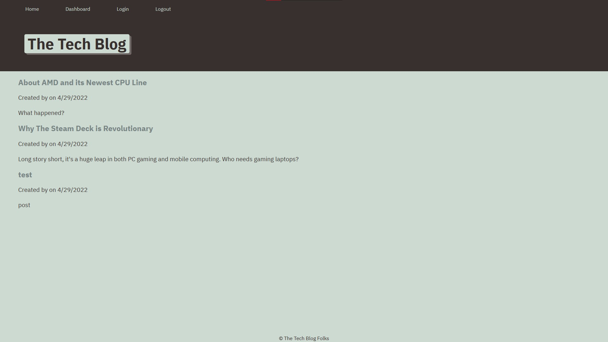

# Tech Blog

## Description

This tech blog uses API routes, MySQL, Sequelize (Object Relational Mapping, Model-View Control), and Handlebars to dynamically link & render web pages & user-made posts, accounts, and comments.

## Installation

If Node.js and MySQL are not already installed in your system, you can get them at <https://nodejs.org> and <https://dev.mysql.com/downloads/mysql/>, respectively. Once installed, download the files in the repository. The files can then be run in a command line window (either Command Prompt, Terminal, or Git Bash depending on what your system & what you have installed).

Open MySQL, create a workbench, copy-and-paste the text from *schema.sql*, then click on the left lightning bolt button to initialize the database.

Within the command line, type "npm i" to install the app's dependencies. "npm run seed" should also be entered to fill the data tables. A *.env* file may need to be created and initialized in the main folder for the app to function.

## Usage

Live application: <https://ajs-tech-blog.herokuapp.com/>

For local use, open the files in a command line, then type either "node server.js" or "npx nodemon server.js".

The user may click on blog posts to see the rest of the article's contents & its comments. In addition, users can create & log into their own account to create blog posts and comments of their own. The user's posts can be accessed in the "Dashboard" link on the top navbar.

## Credits

Special thanks to the University of Minnesota - Twin Cities for jumpstarting my coding journey.

## License

MIT License

Copyright (c) [2023] [Andrew Joo]

Permission is hereby granted, free of charge, to any person obtaining a copy
of this software and associated documentation files (the "Software"), to deal
in the Software without restriction, including without limitation the rights
to use, copy, modify, merge, publish, distribute, sublicense, and/or sell
copies of the Software, and to permit persons to whom the Software is
furnished to do so, subject to the following conditions:

The above copyright notice and this permission notice shall be included in all
copies or substantial portions of the Software.

THE SOFTWARE IS PROVIDED "AS IS", WITHOUT WARRANTY OF ANY KIND, EXPRESS OR
IMPLIED, INCLUDING BUT NOT LIMITED TO THE WARRANTIES OF MERCHANTABILITY,
FITNESS FOR A PARTICULAR PURPOSE AND NONINFRINGEMENT. IN NO EVENT SHALL THE
AUTHORS OR COPYRIGHT HOLDERS BE LIABLE FOR ANY CLAIM, DAMAGES OR OTHER
LIABILITY, WHETHER IN AN ACTION OF CONTRACT, TORT OR OTHERWISE, ARISING FROM,
OUT OF OR IN CONNECTION WITH THE SOFTWARE OR THE USE OR OTHER DEALINGS IN THE
SOFTWARE.
